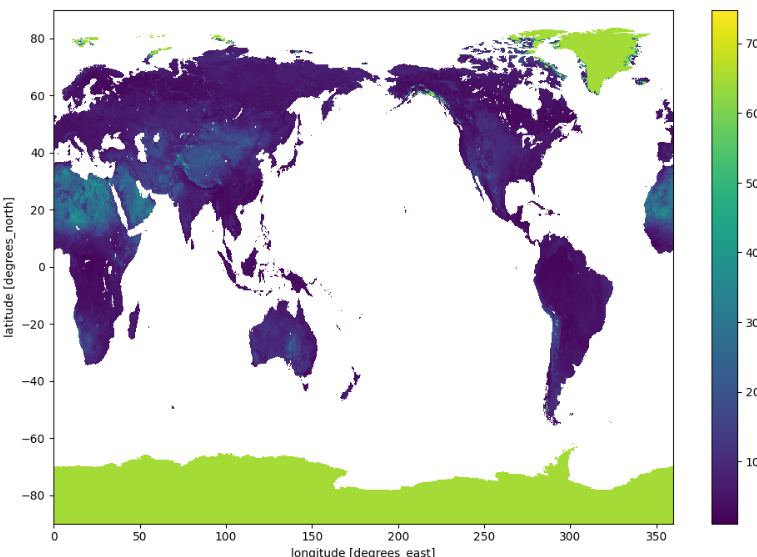

<h1 align="center">
Data Converter for Xarray & Zarr Conversion
</h1>

    
    
    
    
    
    

<h5 align="center">
[Prerequisites](#Prerequisites) • [Quick Start](#Quick-Start) • [Environment Setup](#Environment-Setup) • [Status](#Status) • [What's Included](#What's-Included) • [Documentation](#Documentation) • [References](#Reference(s))
</h5>

# About

__Purpose:__

The purpose of this application is to allow users to convert multidimensional to Xarray & Zarr. The will support developers working on UFS-based applications.

# Table of Contents
* [Prerequisites](#Prerequisites)
* [Dataset](#Dataset)
* [Quick Start](#Quick-Start)
* [Environment Setup](#Environment-Setup)
* [Status](#Status)
* [What's Included](#What's-Included)
* [Documentation](#Documentation)
* [References](#Reference(s))

# Prerequisites
* Python 3.9
* Setting up conda environment w/in RDHPCS.
    * Refer to [Environment Setup](#Environment-Setup)

# Quick Start
1) Install miniconda per the "Environment Setup" section.
2) Create a conda environment based on the YAML file provided within this repository via executing the following command:

   * conda env create -f data_converter.yml

3) Activate the conda environment via executing the following command:

   * conda activate data_converter

4) Save the data in need of conversion under **/raw_data**. If an object needs to be downloaded from Amazon Web Services (AWS) S3 storage, then execute the following command within your terminal:

   * python main_s3_download.py -b <bucket_arn> -k <key> -z <save_as_fn> 

      * bucket (str): Cloud bucket's Amazon Resource Name (ARN). 
              Options: 'noaa-ufs-regtests-pds', 'noaa-ufs-land-da-pds',
              'noaa-ufs-srw-pds'
   
      * key (str): Key of the object in cloud.
   
      * save_as_fn (str): Name to save object as file.

**Note:** After execution, the object will be migrated to the following folder, **/raw_data**.

5) Execute the following command to convert a netCDF data file to Zarr.

   * python main_nc2zarr_converter.py -f <filename> -z <filename2save> -d <refactor_variables_if_applicable>

      * filename(str): Name of the file of interest location of the raw (unprocessed) files (default: **/raw_data**)
                       Include file extension (e.g. .nc, .nc4).
               
      * filename2save(str): Name to save Zarr as under **/zarr_data**.

      * refactor_variables (list): List of multidimensional variables for which will require refactoring in their 
                                   naming convention. In some cases, a multidimensional data will require refactoring
                                   specific multidimensional variables when using the Xarray package. This is due to Xarray's
                                   restirction on duplicated variable names shared between coordinates & dimension variables. 
                                   Xarray will not allow for these duplicated variable names as it conflicts to its
                                   restriction. As a result, some netCDF files will require variable names
                                   to be refactored. If a file does not feature duplication in variables, then set argument
                                   to None. Default: None.
   
**Note:** The newly converted data will be located under **/zarr_data*.* After execution, if a Zarr with the given name of interest already exist under **/zarr_data**, then the user will have to either declare a new name for the zarr or remove the exisitng zarr residing within **/zarr_data**.
   
7) Execute the following command to convert a GRIB file to Zarr. **Note:** Some of the GRIB files will require users to filter the data by its key, in order to convert the data to Zarr. In many cases, a key will have to be declared if a GRIB file features a unique key with many different values. For example, it was tested that some of the UFS .GrbF## formatted files presented a unique key with many different values. In this case, the conversion of the GRIB file to Xarray & Zarr must be performed while filtering the data by its key.

   * python main_grb2zarr_converter.py -f <filename> -z <filename2save> -k <GRIB_KEY_1 GRIB_VALUE_2 ... GRIB_KEY_N_(if_applicable)> -v <GRIB_VALUE_1 GRIB_VALUE_2 ... GRIB_VALUE_N_(if_applicable)>

      * filename(str): Name of the file of interest (e.g. filename.grb, filename.GrbF##) located under **/raw_data**.
   
      * filename2save(str): Name to save Zarr as under **/zarr_data**.            
   
      * grb_key (str): Unique GRIB's Xarray key of interest. In some cases, GRIB files (e.g. .Grbf##) may feature
                       multiple values of a unique key per variable. This will require the user to filter
                       the GRIB's Xarray by its unique key because Xarray package retricts representing a
                       GRIB file that contains more than one hypercube of the same variable.
   
      * grb_val (str): Unique GRIB's Xarray value to the GRB key of interest. In some cases, GRIB files (e.g. .Grbf##) may feature
                       multiple values of a unique key per variable. This will require the user to filter
                       the GRIB's Xarray by its unique key-to-value pair because Xarray package retricts representing a
                       GRIB file that contains more than one hypercube of the same variable.   
   
**Note:** The newly converted data will be located under **/zarr_data**. After execution, if a Zarr with the given name of interest already exist under **/zarr_data**, then the user will have to either declare a new name for the zarr or remove the exisitng zarr residing within **/zarr_data**.
   
8) Execute the following command to load a Zarr.
   
   * python main_load_zarr.py -z <zarr_store> -v <variable> 

      * zarr_store (str): Name of the Zarr under the location of the 
                          zarr files (default: **/zarr_data**). 

      * variable (str): Variable of interest within Zarr.

9) If applicable, execute the following command to convert Zarr to netCDF.
   
   * python main_zarr2nc.py -z <zarr_store> -c <combine_by> 
   
      * zarr_store (str): Name of the Zarr store.
   
      * combine_by (str): Method to combine all data within Zarr. 
                          Some options: "nested" or "by_coords"
   
**Note:** The newly converted data will be saved under **/nc_data**. After execution, the file with the given filename of interest will be overwritten if the filename already exist under **/nc_data**.
   

# Environment Setup:

* Install miniconda on your machine. Note: Miniconda is a smaller version of Anaconda that only includes conda along with a small set of necessary and useful packages. With Miniconda, you can install only what you need, without all the extra packages that Anaconda comes packaged with:
Download latest Miniconda (e.g. 3.9 version):

    * wget https://repo.anaconda.com/miniconda/Miniconda3-py39_4.9.2-Linux-x86_64.sh

* Check integrity downloaded file with SHA-256:

    * sha256sum Miniconda3-py39_4.9.2-Linux-x86_64.sh

Reference SHA256 hash in following link: https://docs.conda.io/en/latest/miniconda.html

* Install Miniconda in Linux:

    * bash Miniconda3-py39_4.9.2-Linux-x86_64.sh

* Next, Miniconda installer will prompt where do you want to install Miniconda. Press ENTER to accept the default install location i.e. your $HOME directory. If you don't want to install in the default location, press CTRL+C to cancel the installation or mention an alternate installation directory. If you've chosen the default location, the installer will display “PREFIX=/var/home//miniconda3” and continue the installation.

* For installation to take into effect, run the following command:

source ~/.bashrc

* Next, you will see the prefix (base) in front of your terminal/shell prompt. Indicating the conda's base environment is activated.

* Once you have conda installed on your machine, perform the following to create a conda environment:

    * To create a new environment (if a YAML file is not provided)

        * conda create -n [Name of your conda environment you wish to create]

(OR)

    * To ensure you are running Python 3.9:

        * conda create -n myenv Python=3.9

(OR)

* To create a new environment from an existing YAML file (if a YAML file is provided):

    * conda env create -f environment.yml

*Note: A .yml file is a text file that contains a list of dependencies, which channels a list for installing dependencies for the given conda environment. For the code to utilize the dependencies, you will need to be in the directory where the environment.yml file lives.

### Activate the new environment via:

conda activate [Name of your conda environment you wish to activate]

* Verify that the new environment was installed correctly via:

    * conda info --env

*Note:

* From this point on, must activate conda environment prior to .py script(s) or jupyter notebooks execution using the following command: conda activate
    * To deactivate a conda environment:
        * conda deactivate

## Open & Run Application on Jupyter Notebook (Optional)

* Open OnDemand has a built-in file explorer and file transfer application available directly from its dashboard via:

    * Login to https://orion-ood.hpc.msstate.edu/

* In the Open OnDemand Interface, select Interactive Apps > Jupyter Notbook

### Additonal Information

To create a .yml file, execute the following commands:

* Activate the environment to export:

    * conda activate myenv

* Export your active environment to a new file:

    * conda env export > [ENVIRONMENT FILENAME].yml

# Status

# What's Included
Within the download, you will find the following directories and files:
* Demo:
    * 
* Scripts:
    * Modules:
        * .py
            * 
        *  .py
            *
        *  .py
            *   
    * Main:
        * .py
            * Main executable script for 
        * .py
            *  Main executable script for 

* List of Dependencies: 
    * data_converter.yml

# Documentation

# Version:
* Draft as of 
