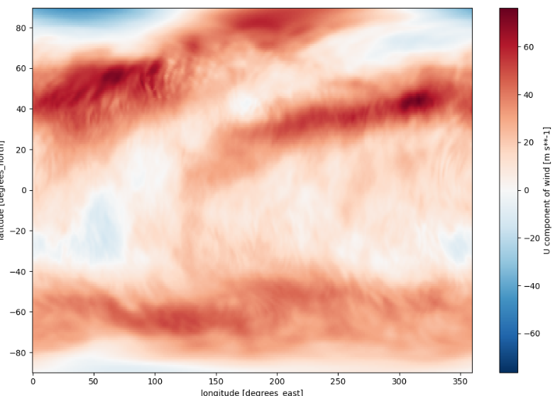

<h1 align="center">
Data Converter
</h1>

    
     

<h5 align="center">
    
[Prerequisites](#Prerequisites) • [Dataset](#Dataset) • [Quick Start](#Quick-Start) • [Environment Setup](#Environment-Setup) • [Status](#Status)
 • [What's Included](#What's-Included) • [Documentation](#Documentation) • [References](#Reference(s))

</h5>

# About

__Purpose:__

The purpose of this program is to convert NetCDF to Zarr data. The program will support the developers of the various UFS applications.

According to Amazon AWS, the following conditions need to be considered when transferring data to cloud data storage:

* Largest object that can be uploaded in a single PUT is 5 GB.
* Individual Amazon S3 objects can range in size from a minimum of 0 bytes to a maximum of 5 TB.
* For objects larger than 100 MB, Amazon recommends using the Multipart Upload capability.
* The total volume of data in a cloud data storage bucket are unlimited.

Tools which could be be utilized to perform data transferring & partitioning (Multipart Upload/Download) are:

* AWS SDK
* AWS CLI
* AWS S3 REST API

In this demontration, the framework will implement Python AWS SDK for transferring datasets from the RDHPCS, Orion, to the cloud data storage with low latency. 

The AWS SDK will be implemented for the following reasons:
To integrate with other python scripts.
AWS SDK carries addition capabilities/features for data manipulation & transferring compare to the aforementioned alternate tools.

# Table of Contents
* [Prerequisites](#Prerequisites)
* [Dataset](#Dataset)
* [Quick Start](#Quick-Start)
* [Environment Setup](#Environment-Setup)
* [Status](#Status)
* [What's Included](#What's-Included)
* [Documentation](#Documentation)
* [References](#Reference(s))

# Prerequisites
* Python 3.9
* Setting up AWS CLI configurations for uploading to Cloud.
* Setting up conda environment w/in RDHPCS.
    * Refer to [Environment Setup](#Environment-Setup)

# Dataset
Datasets on-premise.

# Quick Start
1) Install miniconda per "Environment Setup" section.
2) Establish AWS credentials configuration file via the "AWS Command Line Interface (AWS CLI) Credentials Setup" page in Confluence.
3) [Option to download file from S3.]
4) Execute the following command within the terminal to migrate the data to cloud: python #########.py -b BUCKET_NAME -f FILE_DIR_TO_CONVERT_INCLUDING_FILENAME
* BUCKET_NAME = land-da
* FILE_DIR_TO_MIGRATE_TO_CLOUD_INCLUDING_FILENAME: For example, the object's key would be formatted in cloud as " ############/##########.nc." So,  FILE_DIR_TO_MIGRATE_TO_CLOUD_INCLUDING_FILENAME = ############/##########.nc.

# Environment Setup:

* Install miniconda on your machine. Note: Miniconda is a smaller version of Anaconda that only includes conda along with a small set of necessary and useful packages. With Miniconda, you can install only what you need, without all the extra packages that Anaconda comes packaged with:
Download latest Miniconda (e.g. 3.9 version):

    * wget https://repo.anaconda.com/miniconda/Miniconda3-py39_4.9.2-Linux-x86_64.sh

* Check integrity downloaded file with SHA-256:

    * sha256sum Miniconda3-py39_4.9.2-Linux-x86_64.sh

Reference SHA256 hash in following link: https://docs.conda.io/en/latest/miniconda.html

* Install Miniconda in Linux:

    * bash Miniconda3-py39_4.9.2-Linux-x86_64.sh

* Next, Miniconda installer will prompt where do you want to install Miniconda. Press ENTER to accept the default install location i.e. your $HOME directory. If you don't want to install in the default location, press CTRL+C to cancel the installation or mention an alternate installation directory. If you've chosen the default location, the installer will display “PREFIX=/var/home//miniconda3” and continue the installation.

* For installation to take into effect, run the following command:

source ~/.bashrc

* Next, you will see the prefix (base) in front of your terminal/shell prompt. Indicating the conda's base environment is activated.

* Once you have conda installed on your machine, perform the following to create a conda environment:

    * To create a new environment (if a YAML file is not provided)

        * conda create -n [Name of your conda environment you wish to create]

(OR)

    * To ensure you are running Python 3.9:

        * conda create -n myenv Python=3.9

(OR)

* To create a new environment from an existing YAML file (if a YAML file is provided):

    * conda env create -f environment.yml

*Note: A .yml file is a text file that contains a list of dependencies, which channels a list for installing dependencies for the given conda environment. For the code to utilize the dependencies, you will need to be in the directory where the environment.yml file lives.

### Activate the new environment via:

conda activate [Name of your conda environment you wish to activate]

* Verify that the new environment was installed correctly via:

    * conda info --env

*Note:

* From this point on, must activate conda environment prior to .py script(s) or jupyter notebooks execution using the following command: conda activate
    * To deactivate a conda environment:
        * conda deactivate

### Link Home Directory to Dataset Location on RDHPCS Platform

* Unfortunately, there is no way to navigate to the "/work/" filesystem from within the Jupyter interface when working on the remote server, Orion. The best way to workaround is to create a symbolic link in your home folder that will take you to the /work/ filesystem. Run the following command from a linux terminal on Orion to create the link:

    * ln -s /work /home/[Your user account name]/work

* Now, when you navigate to the /home/[Your user account name]/work directory in Jupyter, it will take you to the /work folder. Allowing you to obtain any data residing within the /work filesystem that you have permission to access from Jupyter. This same procedure will work for any filesystem available from the root directory.

*Note: On Orion, user must sym link from their home directory to the main directory containing the datasets of interest.

## Open & Run Application on Jupyter Notebook

* Open OnDemand has a built-in file explorer and file transfer application available directly from its dashboard via:

    * Login to https://orion-ood.hpc.msstate.edu/

* In the Open OnDemand Interface, select Interactive Apps > Jupyter Notbook

### Additonal Information

To create a .yml file, execute the following commands:

* Activate the environment to export:

    * conda activate myenv

* Export your active environment to a new file:

    * conda env export > [ENVIRONMENT FILENAME].yml

# Status

# What's Included
Within the download, you will find the following directories and files:
* Demo:
    * 
* Scripts:
    * Modules:
        * .py
            * 
        *  .py
            *
        *  .py
            *   
    * Main:
        * .py
            * Main executable script for 
        * .py
            *  Main executable script for 

* List of Dependencies: 
    * data_converter.yml

# Documentation

# Version:
* Draft as of 
